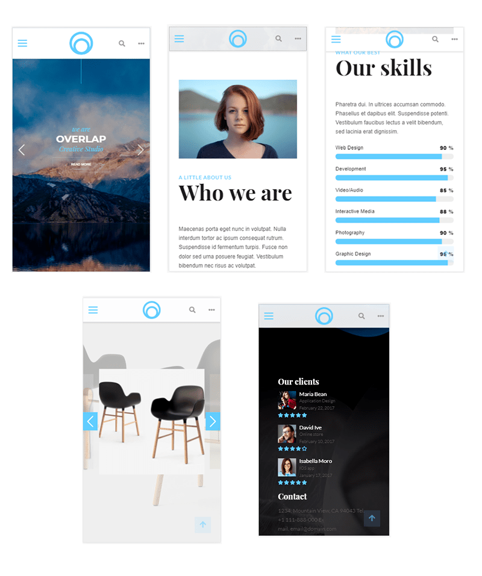

# Creative-Studio lending

#### (Шаблон lending Creative-Studio)
***
### Вы можете скачать шаблон Creative-Studio Zip архивом.

---

***
### Про Шаблон:
**Lending для Creative-Studio** - это шаблон для одностраничного сайта в основе настраиваемые jquery библиотеки с версткой на bootstrap 3 и предпроцессора SCSS. Шаблон адаптивный с анимацией, эффектами, прогресс баром и блока с достижениями компании, а так же портфолио в виде карусели.

### Технические зависимости:
  + [jquery](https://jquery.com/)
  + [scss](https://sass-scss.ru/guide/)
  + [simple-line-icons](http://simplelineicons.com/)
  + [Font Awesome v5](https://fontawesome.com/)
  + [owl-carousel](https://owlcarousel2.github.io/OwlCarousel2/)
  + [kai_menu](https://github.com/AndreiKaragayr/kai-menu.git)
  + [kai_slide](https://github.com/AndreiKaragayr/slide_Overla.git)
  + [area_scroll](https://github.com/AndreiKaragayr/area-scroll.git)
  + [carousel-kai](https://github.com/AndreiKaragayr/carousel-kai.git)
  + [kai_progress_board](https://github.com/AndreiKaragayr/kai-progress-board.git)
  
 > Все зависимости собраны и подключены в библиотеке, вы можете все подключения забрать в `index.html`
 >> Для компиляции scss использовался `npm gulp`
